```mermaid
%%{init: {'theme': 'base', 'themeVariables': {'primaryColor': '#1a3a6b', 'primaryTextColor': '#ffffff', 'primaryBorderColor': '#0055bb', 'lineColor': '#555555', 'secondaryColor': '#1d6f42', 'tertiaryColor': '#e6a817', 'background': '#ffffff', 'nodeBorder': '#0055bb', 'clusterBkg': '#eaf0fb', 'titleColor': '#111111', 'edgeLabelBackground': '#f5f5f5', 'fontSize': '13px'}}}%%
flowchart TB

    %% ── LAYER I ─────────────────────────────────────────────────────────────
    subgraph L1["  LAYER I — INTEGRATION & ACCESS                                          EXTERNAL-FACING  "]
        direction LR

        SDK["<b>AMTTP Open-Source SDK</b><br/><i>TypeScript / Python Client Library</i><br/>─────────────────────────<br/>• Transaction Construction<br/>• Wallet Signature (EIP-712)<br/>• WebSocket Event Streaming<br/>• Batch Scoring Interface"]

        RESTAPI["<b>RESTful API Interface</b><br/><i>JSON / HTTP + WebSocket</i><br/>─────────────────────────<br/>• POST /evaluate<br/>• POST /score/address<br/>• GET /profiles/{addr}<br/>• SSE /webhook/stream"]

        WEBAPP["<b>Web Application Layer</b><br/><i>Flutter Consumer App (3010) + Next.js War Room (3006)</i><br/>─────────────────────────────────────────<br/>• MetaMask Wallet Integration<br/>• Compliance Dashboard (R1–R6 RBAC)<br/>• Detection Studio &amp; Graph Explorer<br/>• zkNAF Proof Verification UI"]
    end

    L1 -- "HTTP/WS — Authenticated Request" --> L2

    %% ── LAYER II ────────────────────────────────────────────────────────────
    subgraph L2["  LAYER II — GATEWAY & ROUTING                                               API GATEWAY  "]

        GW["<b>Oracle Service — Express.js TypeScript Gateway (port 3001)</b><br/>────────────────────────────────────────────────────────────────────<br/>• Modular router domains: risk/ · kyc/ · compliance/ · dispute/<br/>• EIP-712 signature validation · JSON-RPC relay to Orchestrator<br/>• Rate limiting · API key authentication · CORS middleware"]
    end

    L2 -- "Authenticated Internal Request" --> L3

    %% ── LAYER III ───────────────────────────────────────────────────────────
    subgraph L3["  LAYER III — PROTOCOL LOGIC & COMPUTATION (THE SINGULAR STACK)              CORE ENGINE  "]

        ORCH["<b>Compliance Orchestrator — Central Decision Coordinator (port 8007)</b><br/>─────────────────────────────────────────────────────────────────────────<br/>• Fan-out to downstream services via aiohttp &nbsp;•&nbsp; Aggregate multi-signal decisions<br/>• Profile &amp; entity management &nbsp;•&nbsp; API key issuance &amp; RBAC enforcement"]

        ORCH -- "§3.1 Identity" --> IDM
        ORCH -- "§3.2 Tx Sequencing" --> TSM
        ORCH -- "§3.3 ML/Graph Risk" --> GRE
        ORCH -- "§3.4 ZK Proofs" --> ZKM

        subgraph MODS[" "]
            direction LR

            IDM["<b>§3.1 Identity Management Module</b><br/><i>Sanctions Screening (port 8004)</i><br/>─────────────────────────<br/>• OFAC / EU / UK FATF list screening<br/>• KYC status &amp; PEP tracking<br/>• Entity profile management"]

            TSM["<b>§3.2 Transaction Sequencing Module</b><br/><i>FCA Policy (8003) · GeoRisk (8006)</i><br/><i>Monitoring (8005) · Integrity (8008)</i><br/>────────────────────────────<br/>• UK FCA regulatory rule engine<br/>• Jurisdiction risk scoring<br/>• Real-time alerting &amp; event streaming<br/>• Merkle proof data integrity validation"]

            GRE["<b>§3.3 Graph-Powered Risk Engine (ML/DL)</b><br/><i>ML Risk API (8000) · Graph Service (8001)</i><br/><i>Explainability Service (8009)</i><br/>─────────────────────────────<br/>• XGBoost / LightGBM ensemble scoring<br/>• GraphSAGE on Memgraph topology<br/>• Knowledge distillation pipeline<br/>• SHAP / LIME per-feature explanations"]

            ZKM["<b>§3.4 ZK-NAF Verifier</b><br/><i>Zero-Knowledge Service (port 8010)</i><br/>─────────────────────────<br/>• Groth16 ZK-SNARKs on BN254 curve<br/>• KYC credential proof (no data leak)<br/>• Risk score range proof<br/>• Sanctions non-membership proof"]
        end

        IDM -- "sanctions_hit, kyc_status" --> MATRIX
        TSM -- "rule_alerts, geo_risk" --> MATRIX
        GRE -- "risk_score, explanations" --> MATRIX
        ZKM -- "zk_proof_valid" --> MATRIX

        MATRIX["<b>COMPLIANCE DECISION MATRIX — DETERMINISTIC ACTION RESOLUTION</b><br/>────────────────────────────────────────────────────────────────────────────<br/>P &lt; 0.4 ∧ ¬sanctioned ∧ geo=LOW → <b>ALLOW</b> &nbsp;&nbsp;&nbsp;&nbsp; | &nbsp;&nbsp;&nbsp;&nbsp; 0.4 ≤ P &lt; 0.7 ∧ ¬sanctioned → <b>REVIEW</b><br/>P ≥ 0.7 ∧ ¬sanctioned → <b>ESCROW</b> &nbsp;&nbsp;&nbsp;&nbsp;&nbsp;&nbsp;&nbsp;&nbsp; | &nbsp;&nbsp;&nbsp;&nbsp; sanctioned ∨ FATF_blacklist → <b>BLOCK</b>"]
    end

    MATRIX -- "action ∈ {ALLOW, REVIEW, ESCROW, BLOCK}" --> L4

    %% ── LAYER IV ────────────────────────────────────────────────────────────
    subgraph L4["  LAYER IV — PRODUCTION & DEPLOYMENT                                       INFRASTRUCTURE  "]

        APIGW["<b>API Gateway — NGINX Reverse Proxy + Cloudflare Tunnel</b><br/>• TLS termination &nbsp;•&nbsp; Rate limiting (100 req/s) &nbsp;•&nbsp; Path-based routing (/api, /risk, /geo ...)<br/>• Cloudflare Tunnel (production) &nbsp;•&nbsp; Prometheus + Grafana observability"]

        APIGW --> ONCHAIN
        APIGW --> PERSIST

        subgraph ONCHAIN["§4.1 On-Chain Verification — Ethereum Smart Contracts (UUPS Proxy, OpenZeppelin)"]
            direction LR

            SC1["<b>AMTTPCore</b><br/>• Risk Oracle<br/>• Escrow Logic<br/>• Tx Validation<br/>• onlyOracle modifier"]
            SC2["<b>AMTTTPNFT</b><br/>• KYC Compliance Badges<br/>• On-chain Compliance ID<br/>• ERC-721 standard"]
            SC3["<b>DisputeResolver</b><br/>• Kleros Arbitration<br/>• MetaEvidence protocol<br/>• Appeal management"]
            SC4["<b>CrossChain</b><br/>• LayerZero Bridge<br/>• Cross-chain score relay<br/>• Multi-network support"]
            SC5["<b>zkNAF Circuits</b><br/>• KYC Credential proof<br/>• Risk Range Proof<br/>• Sanctions Non-Membership<br/>• BN254 pairing check"]
        end

        subgraph PERSIST["§4.2 Data Persistence Layer"]
            direction LR

            DB1["<b>MongoDB</b><br/><i>Document Store (27017)</i><br/>• Profiles &amp; Alerts<br/>• Transaction History<br/>• Compliance Records"]
            DB2["<b>Redis</b><br/><i>Cache Layer (6379)</i><br/>• Session Management<br/>• Rate Limit Counters<br/>• Hot Score Cache"]
            DB3["<b>Memgraph</b><br/><i>Graph Database (7687)</i><br/>• Entity Relations<br/>• Risk Path Analysis<br/>• GraphSAGE data"]
            DB4["<b>Helia (IPFS)</b><br/><i>Immutable Store</i><br/>• Audit Logs<br/>• Compliance Evidence<br/>• Tamper-proof records"]
            DB5["<b>HashiCorp Vault</b><br/><i>Secrets Management</i><br/>• API Keys &amp; Tokens<br/>• Service Credentials<br/>• Encryption Keys"]
        end

        CLOUDINFRA["<b>Cloud Infrastructure — Container Orchestration</b><br/>• Docker Compose (unified / full-stack / production variants)<br/>• Supervisord process management &nbsp;•&nbsp; MinIO object storage<br/>• Prometheus + Grafana observability stack &nbsp;•&nbsp; HashiCorp Vault (secrets)"]

        ONCHAIN --> CLOUDINFRA
        PERSIST --> CLOUDINFRA
    end

    %% ── STYLES ──────────────────────────────────────────────────────────────
    classDef clientNode    fill:#1a3a6b,stroke:#0055bb,color:#fff,rx:6
    classDef gatewayNode   fill:#4a1080,stroke:#7700cc,color:#fff,rx:6
    classDef orchestrator  fill:#1d6f42,stroke:#2da05e,color:#fff,rx:6
    classDef moduleNode    fill:#17503a,stroke:#25855a,color:#fff,rx:6
    classDef matrixNode    fill:#c47d00,stroke:#e6a817,color:#fff,rx:6
    classDef infraNode     fill:#b85c00,stroke:#e07000,color:#fff,rx:6
    classDef onchainNode   fill:#3a006b,stroke:#7733cc,color:#fff,rx:4
    classDef dbNode        fill:#1a3a5c,stroke:#2a5a9c,color:#fff,rx:4

    class SDK,RESTAPI,WEBAPP clientNode
    class GW gatewayNode
    class ORCH orchestrator
    class IDM,TSM,GRE,ZKM moduleNode
    class MATRIX matrixNode
    class APIGW,CLOUDINFRA infraNode
    class SC1,SC2,SC3,SC4,SC5 onchainNode
    class DB1,DB2,DB3,DB4,DB5 dbNode
```

# AMTTP Protocol — Four-Layer System Architecture

*Anti-Money Laundering Transaction Trust Protocol*  
*IEEE Technical White Paper — Version 3.0 — May 2026*

---

---

**Legend**

| Colour | Layer |
|--------|-------|
| 🔵 Dark Blue | Layer I — Integration & Access (Client-Facing) |
| 🟣 Purple | Layer II — Gateway & Routing (Oracle Service) |
| 🟢 Dark Green | Layer III — Protocol Logic & Computation (Core Engine) |
| 🟠 Orange | Layer IV — Production & Deployment (Infrastructure) |
| 🟡 Amber | Compliance Decision Matrix |
| 🔮 Deep Purple | On-Chain Smart Contracts |
| 🔷 Navy | Data Persistence Layer |

---

*AMTTP Protocol v3.0 — Anti-Money Laundering Transaction Trust Protocol*  
*IEEE Technical White Paper — © 2026*
